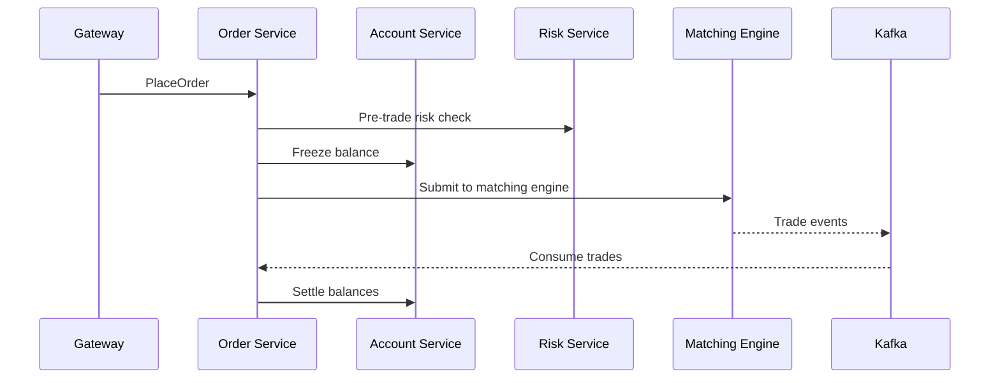

# mantis-order

Order lifecycle management service for [Mantis Exchange](https://github.com/mantis-exchange). Validates orders, freezes balances, submits to the matching engine, and settles trades.

## Flow



## Configuration

| Variable | Default | Description |
|----------|---------|-------------|
| `PORT` | `50052` | gRPC server port |
| `DB_URL` | `postgres://...` | PostgreSQL |
| `MATCHING_ENGINE_ADDR` | `localhost:50051` | Matching engine |
| `KAFKA_BROKERS` | `localhost:9092` | Kafka brokers |
| `ACCOUNT_SERVICE_ADDR` | `http://localhost:50053` | Account service |
| `RISK_SERVICE_ADDR` | `http://localhost:50055` | Risk service |

## Quick Start

```bash
go build -o mantis-order ./cmd/order
./mantis-order
```

## Part of [Mantis Exchange](https://github.com/mantis-exchange)

MIT License
